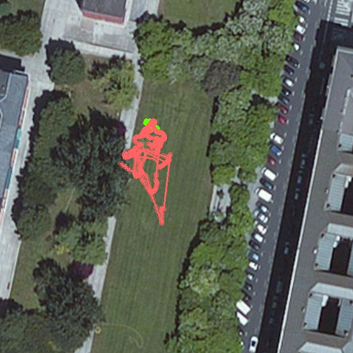

# MAVFlightview
This program allows to show the GPS position in an image. The program downloads a satellite image (you can select the service: Google, Microsoft, Yahoo and others) of the flight area and it draws flight path.

Reverse words: **Manual**, **AUTO**, **LOITER**, **FBWA**, **RTL**, **STABILIZE**, **LAND**, **STEERING**, **HOLD,** **ALT_HOLD**, **CIRCLE**, **POSITION**, **GUIDED**, **ACRO** and **CRUISE**.

Usage:
```
mavflightview.py [options]
```

Options:
```
-h, --help            show this help message and exit
  --service=SERVICE     tile service
  --mode=MODE           flight mode
  --condition=CONDITION
                        conditional check on log
  --mission=MISSION     mission file (defaults to logged mission)
  --fence=FENCE         fence file
  --imagefile=IMAGEFILE
                        output to image file
  --flag=FLAG           flag positions
  --rawgps              use GPS_RAW_INT
  --rawgps2             use GPS2_RAW
  --dualgps             use GPS_RAW_INT and GPS2_RAW
  --ekf                 use EKF1 pos
  --ahr2                use AHR2 pos
  --debug               show debug info
  --multi               show multiple flights on one map
```

Example:
If you want to save the path in a file, you need to add the flag `--imagefile <name>`

```bash
python mavflightview.py --imagefile output.jpg 25.BIN
```

You are going to see a image similar to this one. A satellite image with the flight path draw in different colors (for each flight mode)



If you want to see one flight mode you need to add the flag `--mode <MODE>`. You have to change the word `MODE` for one of the reverse words.

```bash
python mavflightview.py --imagefile output.jpg --mode ALT_HOLD 25.BIN

```
In the following you can only see the flight that it corresponds to the altitude hold mode.


