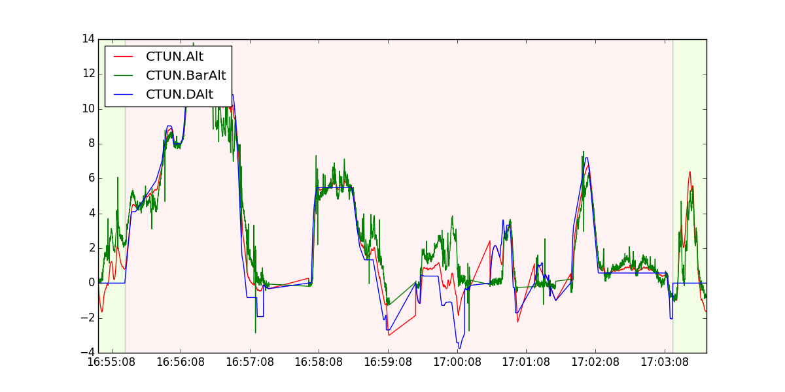

# MAVGraph

MAVGraph can graph any of the flight data. The commands are exactly the same as the graph module in MAVProxy.

Usage:
```bash
mavgraph.py [-h] [--no-timestamps] [--planner] [--condition CONDITION]
                   [--labels LABELS] [--legend LEGEND] [--legend2 LEGEND2]
                   [--marker MARKER] [--linestyle LINESTYLE] [--xaxis XAXIS]
                   [--multi] [--zero-time-base] [--flightmode FLIGHTMODE]
                   [--output OUTPUT]
                   <LOG or FIELD> [<LOG or FIELD> ...]
```

Positional arguments:
```bash
<LOG or FIELD>
```

Optional arguments:
```bash
  -h, --help            show this help message and exit
  --no-timestamps       Log doesn't have timestamps
  --planner             use planner file format
  --condition CONDITION
                        select packets by a condition
  --labels LABELS       comma separated field labels
  --legend LEGEND       default legend position
  --legend2 LEGEND2     default legend2 position
  --marker MARKER       point marker
  --linestyle LINESTYLE
                        line style
  --xaxis XAXIS         X axis expression
  --multi               multiple files with same colours
  --zero-time-base      use Z time base for DF logs
  --flightmode FLIGHTMODE
                        Choose the plot background according to the active
                        flight mode of the specified type, e.g.
                        --flightmode=apm for ArduPilot or --flightmode=px4 for
                        PX4 stack logs. Cannot be specified with --xaxis.
  --output OUTPUT       provide an output format
```

Example:
```bash
mavgraph.py 1.BIN "CTUN.BarAlt" "CTUN.Alt" "CTUN.DAlt"
```

### Flags
####--flightmode

This flag allows to show the different flight modes. The background of the graph changes depending on the flight mode. Here you can see the color code:

```
    'MANUAL'    : (1.0,   0,   0),
    'AUTO'      : (  0, 1.0,   0),
    'LOITER'    : (  0,   0, 1.0),
    'FBWA'      : (1.0, 0.5,   0),
    'RTL'       : (  1,   0, 0.5),
    'STABILIZE' : (0.5, 1.0,   0),
    'LAND'      : (  0, 1.0, 0.5),
    'STEERING'  : (0.5,   0, 1.0),
    'HOLD'      : (  0, 0.5, 1.0),
    'ALT_HOLD'  : (1.0, 0.5, 0.5),
    'CIRCLE'    : (0.5, 1.0, 0.5),
    'POSITION'  : (1.0, 0.0, 1.0),
    'GUIDED'    : (0.5, 0.5, 1.0),
    'ACRO'      : (1.0, 1.0,   0),
    'CRUISE'    : (  0, 1.0, 1.0)
```

In the following graph It's possible to see two different colors. when the background color is green represents the stabilize mode (at the beginning and in the end of the graph, the copter takes off and lands). When the background is red the copter is in altitude hold mode. You can check the color with the description above.



