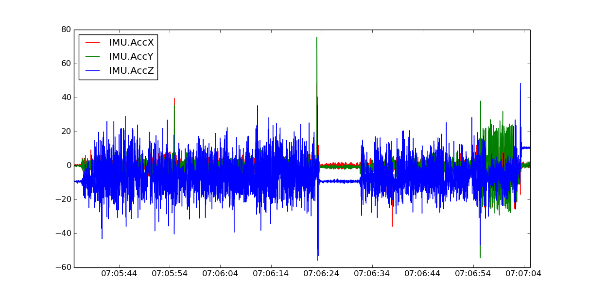
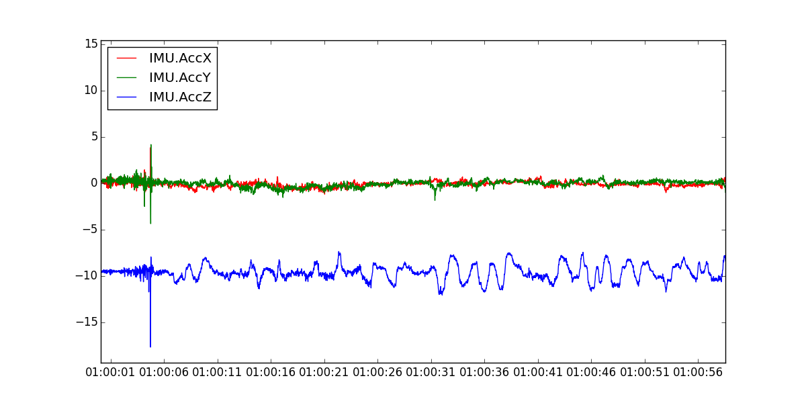

# IMU

High vibrations cause the APM:Copter’s accelerometer based altitude and horizontal position estimates to drift far off from reality which leads to problems with alt hold (normally rocketing into the sky) or Loiter (drifting).

Vibrations are best viewed by graphing the dataflash’s IMU message’s AccX, AccY and AccZ values. **The AccX and AccY values should be between -3 and +3 m/s/s** and the **AccZ should be between -15 and -5 m/s/s**.  The accelerometer values will change momentarily as the copter moves up and down which is why it is better to pull the data from a portion of the flight where the copter was mostly stationary but even with a copter that is moving you can still see the vibration levels by comparing the difference between the top and bottom of the “grass”.  an occasional blade of grass going over the lines is ok but if it’s sustained then it’s likely a real vibration problem.

The below graph shows high vibration levels. The AccX, AccY and AccZ have very big variations. This is not a good result.

The below graph shows acceptable vibration levels. The AccX and AccY values are between -3 and +3 m/s/s and the AccZ is between -15 and -5 m/s/s.

