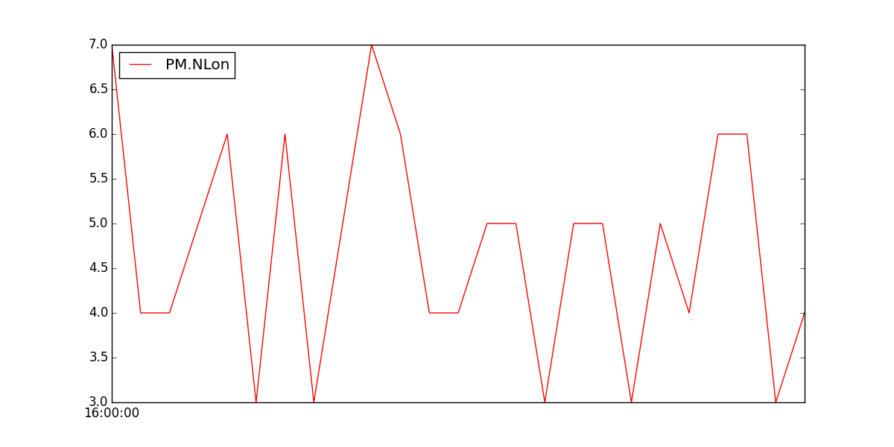

# Performance Monitoring
Performance Monitoring or PM is presented in the dataflash logs as:
```
PM {NLon : 6, NLoop : 1000, MaxT : 23731, PMT : 9, I2CErr : 0, INSErr : 0, INAVErr : 0}
```

This data can be interpreted as:

 + **NLon**: number of long running main loops (i.e. loops that take more than 5% longer than the x ms they should)
 + **NLoop**: the total number of loops since the last PM message was displayed. Normally 1000 and allows you to calculate the percentage of slow running loops which should never be higher than 15%.
 + **MaxT**: the maximum time that any loop took since the last PM message. This should be close to 10,000 but will be up to 6,000,000 during the interval where the motors are armed
 + **PMT**: a number that increments each time a heart beat is received from the ground station
 + **I2CErr, INAVErr, INSErr**: the number of I2C, INAV and INS errors since the last PM message. Any I2C errors may indicate a problem on the I2C bus which may in turn slow down the main loop and cause performance problems.


The number of slow loops can be pictured as:
```
mavgraph.py 5.BIN "PM.NLon"
```



