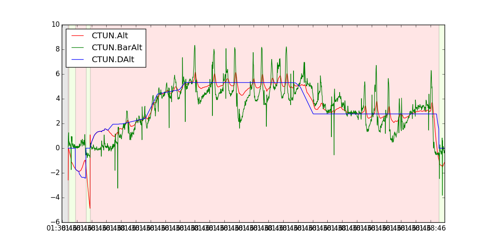
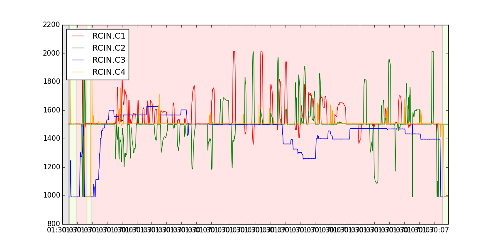

# Barometer-pitch and roll linkage

En ocaciones se pierde 1 o 2 dos metros de altitud en el quadricoptero cuando se produce un movimiento de alta velocidad. Esto es causado por un efecto aerodinámico que conduce a una burbuja de baja presión momentánea que se forma en la parte superior de quadricoptero donde el controlador de suelo considera que se esta ascendiendo por lo tanto reacciona descenciendo.

En las siguiente gráficas se puede observar este hecho. La siguiente gráfica muestra la altitud: BarAlt (altitud del barómetro), DAlt (altitud deseada) y Alt (altitud inercial estimada).

La siguiente gráfica muestra la entrada de radio control. Las líneas azul y amariila representan el acelerador y el *yaw* (el joystick de la izquerda). LA líneas verde y roja representan el *roll* y *pitch* (el joystick de la derecha).

Mirando lo cambios que se produce en la línea roja cuando el valor esta cerca de 2000 (o 1000) significa que se produce un vuelo hacia delante (o hacia atrás) de alta velocidad. También cuando la línea verde esta cerca de 2000 (o 1000) significa que se produce un vuelo de alta velocidad hacia uno de los lados. Si observamos estos instantes en la gráfica de altitud vemos que el barómetro cambia su valor 1 o 2 metros.

**No hay una solución a este problema por el momento, aunque incrementando el valor de INAV_TZ_Z a 7 (el valor por defecto es 5) reduce este efecto pero incrementa la ascensión tan pronto como el modo de bloqueo de altitud este activo.**

El parámetro `INAV_TC_Z` (Vertical Time Constant) es una constante de tiempo para la fusión de información entre el barómetro y los accelerémetros. Un valor de TC alto reduce el impacto de del barómetro en la estimación de altitud (Rango: 0 10, Incremento: 0.1).	