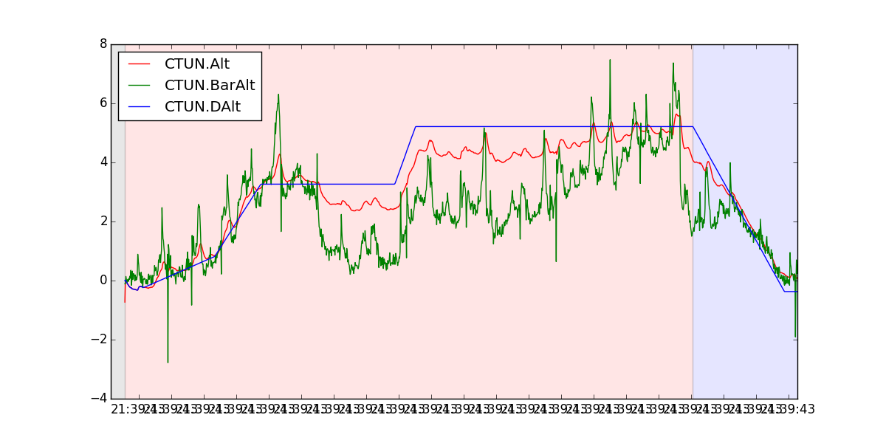

# Aterrizaje

El modo aterrizaje llevar el quadricoptero hacia abajo.

+ **Desciende hasta los 10 metros ** (o hasta que el sonar detecte algo debajo del quadricoptero) utilizando el controlador del modo *bloque de altitud*, descenderá a la velocidad indicada en el parámetro `WPNAV_SPEED_DN` que puede ser modificado.

+ **Por debajo de los 10 metros** el quadricoptero debe descender a la velocidad indicada en el parámetro `LAND_SPEED` que por defecto tiene un valor de 50cm/s.
+ Al llegar a tierra el quadricoptero automáticamente parará los motores y se desarmará si el acelerador esta al mínimo.

En la siguiente gráfica se puede ver el comportamiento del modo aterrizaje. Cuando el fondo de la gráfica es rojo el vehículo se encuentra en modo *bloque de altitud* y el fondo de color azul significa que el modo aterrizaje esta activo. La línea azul representa la altitud deseada. Cuando el vehículo entra en el modo de aterrizaje la altitud deseada comiendo a descender.

**NOTAS**:

+ Si el vehículo no tiene el bloqueo del GPS el control será como el del modo *stabilize*, por lo tanto el piloto puede controlar el *roll*, *pitch* y *yaw*

+ Si el vehículo tiene el bloqueo del GPS el aterrizaje controlará la posición horizontal pero el piloto puede ajustar la posición horizontal deseada como en el modo *Loiter*.

**Cuidado!**

Si algún modo tiene activo el modo *altitude hold* (bloqueo de altitud). Si el comportamiento de quadricoptero comienza a ser errático cuando estas cerca del suelo o aterrizando, probablemente la lectura del barómetro se está viendo afectada por la **presión creada por las hélices sobre el suelo**.

+ Esto se puede verficar facilmente viendo las lecturas de altitud en tus ficheros de log y viendo si hay picos cuando esta cerca del suelo. 
+ Si este es el problema, mueve el controlador de vuelo fuera de la zona del efecto de las hélices o protegelo en un recinto debidamente ventilado.
El éxito se puede verficar realizando un vuelo de prueba y viendo los resultados del log.