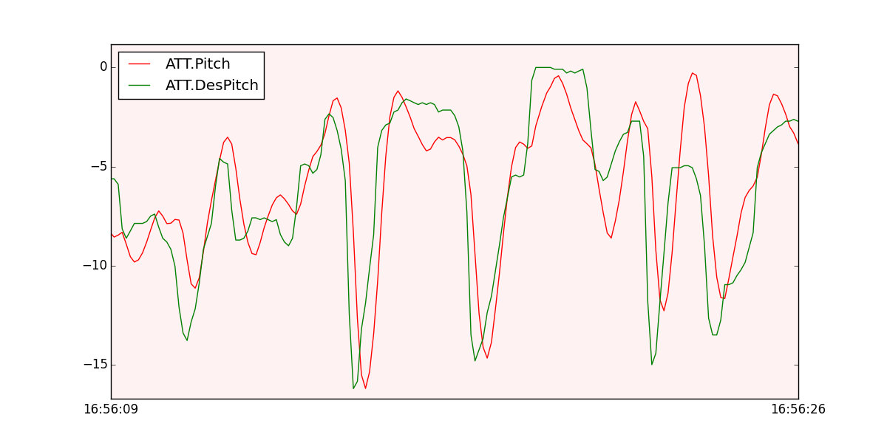
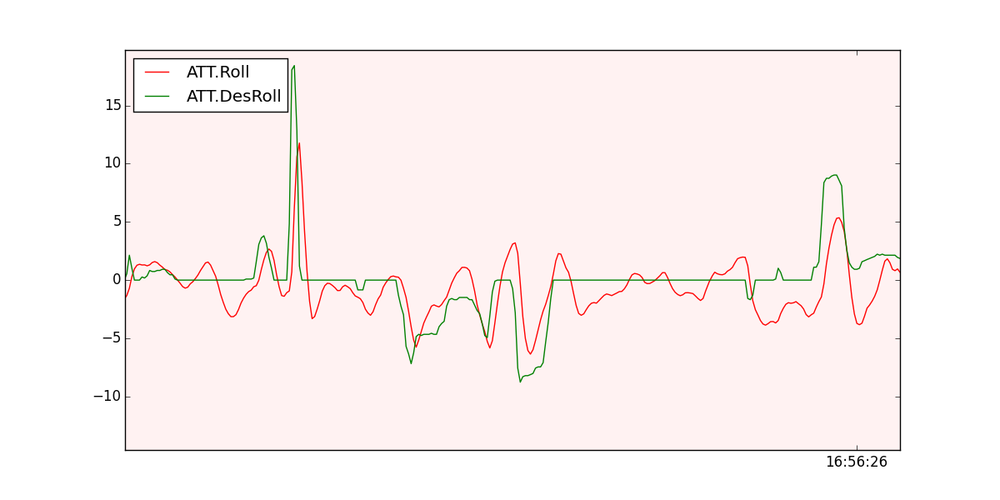

#Modo *Stabilize*

El modo *Stabilize* permite volar el vehículo manualmente, pero estabiliza automáticamente el *pitch* y *roll*.

Si estás aprendiendo a volar, intentalo en el modo **bloqueo de altitud** o **Loiter** en lugar de **Stabilize**. Puedes tener menos golpes si te concentras en menos controles a la vez. Siempre puedes cambiar al modo manual como el modo *Stabilize* si el autopiloto falla en el control del vehículo. **Mantener el control del vehículo es tu responsabilidad**
+ El piloto puede controlar el *pitch* y *roll*. Cuando el piloto suelta los *sticks* el vehículo se estabiliza automáticamente.
+ El piloto tendrá que controlar regularmente el *pitch* y *roll* para mantener el vehículo en la posición deseada ya que es empujado por el viento.
+El piloto controla la velocidad de cambia del *yaw*. Cuando el piloto suelta el *stick* del *yaw* el vehiculo mantendrá esa posición.
+ El piloto controla la velocidad media de los motores. Esto significa que se requiere un ajuste constante del acelerador para mantener una altitud deseada. Si el piloto pone al minimo el acelerador los motores giraran a la velovidad minima establecida en el parámetro `MOT_SPIN_ARMED` y si el vehículo está volando perderá altitud y chocará contra el suelo.
+ El acelerador encia de manera autómatica un ajuste en base al *tilt* que tenga el vehículo. Por ejemplo si se mueve el vehículo hacia uno de sus lados puede perder o ganar altura, por lo tanto el piloto debe compensar este efecto para mantener la altura deseada.

#Comprobando el rendimiento en los ficheros de log

La mejor manera de ver el rendimiento del modo *stabilize* es a través de los ficheros de log. Puedes verlos con la herramiento **mavgraph**, representando los mensajes **ATT**: *Roll* vs *DesRoll* (roll deseado) y *Pitch* vs *DesPitch* (pitch deseado). Tienen que seguirse el uno al otro como se muestra en la siguiente figura.

```
mavgraph.py 1.BIN "ATT.Pitch" "ATT.DesPitch" --flightmode=apm
```


```
mavgraph.py 1.BIN "ATT.Roll" "ATT.DesRoll" --flightmode=apm
```


#Problemas comunes 
+ El vehículo da vueltas después del despegue. Esto en general es causado por lo motores por que el orden esté mal, estén girando en la dirección incorrecta o tenga una hélice incorrecta (recuerda: sentido horario o sentido antihoratio)
+ El vehículo se va hacia un a dirección. Intenta calibrar el acelerómetro.
+ De repende se gira durante el vuelo. Esto casi siempre esta causado por fallos mecánicos de los motores o los ESCs 
